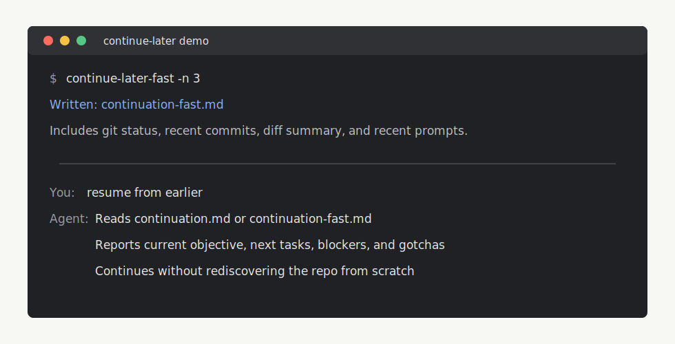

# Continue Later Skills

Handoff skills and a small CLI for AI coding sessions. When you stop mid-project, Continue Later writes the context a future agent actually needs: current git state, recent prompts, pending tasks, gotchas, and exact run commands.

It includes:

- **`continue-later`** for a structured `continuation.md`
- **`continue-later-fast`** for a raw git + recent prompt dump in `continuation-fast.md`
- **`resume-continuation`** for picking work back up later
- optional Cursor, Claude Code, Codex, and Gemini hooks for automatic handoff context



## Demo

```text
You: continue later

Agent/CLI:
  - archives any old continuation.md / continuation-fast.md
  - writes the current git snapshot
  - captures recent local user prompts when enabled
  - leaves continuation.md or continuation-fast.md in the repo root

Later:
You: resume from earlier

Agent:
  - reads the handoff file
  - reports pending tasks, known issues, decisions, gotchas, and run commands
```

For a concrete walkthrough, see [examples/real-workflow-example.md](examples/real-workflow-example.md).

## Install

```bash
curl -fsSL https://raw.githubusercontent.com/dhruv-anand-aintech/continue-later-skill/main/install.sh | bash
```

Requirements: `curl`, `tar`, `bash`, `python3`, network access, and `git` for `continue-later-fast`. Restart Cursor, Claude Code, Codex, Gemini, OpenCode, or other assistants after installing so skills reload.

## Quick Use

Ask the agent in natural language:

- **Handoff:** "Hand this off", "continue later", "save project state"
- **Quick dump:** "quick save", "continue-later-fast", "just dump the context"
- **Resume:** "resume from earlier", "what was I working on?", "show pending tasks"

From a project git root:

```bash
continue-later-fast -n 12
```

That writes `continuation-fast.md` in the repo root.

## What Gets Installed

### Skills

| Skill folder | Role |
| --- | --- |
| `continue-later` | Full structured `continuation.md` with overview, stack, state, tasks, decisions, gotchas, and deploy steps. |
| `continue-later-fast` | Runs the fast CLI for `continuation-fast.md`; no narrative LLM summary in that file. |
| `resume-continuation` | Reads `continuation.md` and/or `continuation-fast.md`, preferring the structured file when both exist. |

### Files and Hooks

| Path | Role |
| --- | --- |
| `$CONTINUE_LATER_CLI_DIR` default `~/.config/continue-later/` | `continue-later-fast.sh`, `git-context-dump.sh`, `session_recent_user_messages.py`, `continue-later-prompt-hook.sh`. |
| `$CONTINUE_LATER_BIN_DIR/continue-later-fast` default `~/.local/bin/continue-later-fast` | Symlink to `continue-later-fast.sh`; add `~/.local/bin` to `PATH` if needed. |
| `~/.cursor/hooks/continue-later-before-submit.sh` | Cursor `beforeSubmitPrompt` hook; writes `continuation-fast.md` on matching prompts. |
| `~/.codex/hooks.json` | Codex `UserPromptSubmit` hook; injects the shared git context dump on matching prompts. |
| `~/.gemini/settings.json` | Gemini `BeforeAgent` hook; injects the shared git context dump on matching prompts. |

## Compatibility

| Tool | Skills install | Fast CLI | Hook support |
| --- | --- | --- | --- |
| Cursor | Yes, `~/.cursor/skills` and `~/.cursor/skills-cursor` | Yes | Yes, `beforeSubmitPrompt`; disk output only. |
| Claude Code | Yes, `~/.claude/skills` | Yes | Manual `UserPromptSubmit` hook under `claude-code/`; injects context. |
| Codex | Yes, `$CODEX_HOME/skills` or `~/.codex/skills` | Yes | Yes, `UserPromptSubmit`; injects context. |
| `~/.agents` | Yes | Yes | No generic hook format assumed. |
| Gemini Antigravity | Yes, `~/.gemini/antigravity/skills` | Yes | No Antigravity-specific hook registration. |
| Gemini CLI | Skills install depends on your local Gemini skill path | Yes | Yes, `BeforeAgent`; injects context. |
| OpenCode | Yes, `~/.config/opencode/skills` | Yes | Not auto-registered; OpenCode uses plugins rather than this repo's simple hook JSON shape. |

## How It Works

1. The installer downloads the repo tarball from GitHub.
2. It copies the three skill folders into any existing assistant skill homes it recognizes.
3. It copies the CLI bundle to `~/.config/continue-later/` by default.
4. It symlinks `continue-later-fast` into `~/.local/bin/`.
5. When supported tool homes exist, it registers prompt hooks that call the shared git-dump helper.
6. Handoff files are always written in the current project root so future agents and teammates can inspect them directly.

## Installer Options

- **`AGENT_SKILLS_DIRS`**: colon-separated list of skill roots. When set, only these paths are used.
- **`CURSOR_SKILLS_DIR`**: legacy single skill directory.
- **`CONTINUE_LATER_CLI_DIR`**: where CLI and hook scripts are copied.
- **`CONTINUE_LATER_BIN_DIR`**: where the `continue-later-fast` symlink is created.
- **`CONTINUE_LATER_CURSOR_HOOK=0`**: skip Cursor hook registration.
- **`CONTINUE_LATER_CODEX_HOOK=0`**: skip Codex hook registration.
- **`CONTINUE_LATER_GEMINI_HOOK=0`**: skip Gemini hook registration.

When no skill destination variables are set, discovery checks existing homes for Cursor, Claude Code, Codex, shared `~/.agents`, Gemini Antigravity, and OpenCode. If none exist, it creates `~/.cursor/skills`.

## Forks and Releases

The default installer tracks `main`:

```bash
curl -fsSL https://raw.githubusercontent.com/dhruv-anand-aintech/continue-later-skill/main/install.sh | bash
```

To install from a fork or a tagged branch:

```bash
curl -fsSL "https://raw.githubusercontent.com/<fork-owner>/continue-later-skill/main/install.sh" | \
  CONTINUE_LATER_SKILLS_REPO="<fork-owner>/continue-later-skill" CONTINUE_LATER_SKILLS_BRANCH=main bash
```

Release notes live in [CHANGELOG.md](CHANGELOG.md).

## Privacy and Safety

Continue Later is local-first. It does not run a hosted service and does not upload repo or transcript data by itself.

`continue-later-fast` reads:

- git metadata and diffs from the current repo
- optional local Claude/Cursor JSONL transcripts under `~/.claude/projects` and `~/.cursor/projects`

It writes:

- `continuation-fast.md` in the current repo root
- timestamped `continuation*.archive.*.md` files when replacing older handoffs

To make the fast dump git-only:

```bash
continue-later-fast --skip-transcript
```

or:

```bash
CONTINUE_LATER_SKIP_TRANSCRIPT=1 continue-later-fast
```

Review generated handoff files before committing them if your repo may contain secrets, private prompts, or proprietary diffs.

## Troubleshooting

**`continue-later-fast: command not found`**

Add `~/.local/bin` to your `PATH`, or run the script directly from `~/.config/continue-later/continue-later-fast.sh`.

**No git repo found**

Run `continue-later-fast` from inside a git worktree. Without git, the script falls back to the current directory but cannot include meaningful git context.

**No transcript found**

This is non-fatal. The file still includes git context. Use `--jsonl /path/to/session.jsonl`, `--agent <id>`, `--from-cwd`, or `--skip-transcript`.

**Invalid `~/.cursor/hooks.json`, `~/.codex/hooks.json`, or `~/.gemini/settings.json`**

Fix the JSON and rerun `install.sh`. The installer refuses to overwrite invalid JSON silently.

**Hooks run when you do not want them**

Rerun the installer with the relevant opt-out variable, then remove the existing hook entry from the tool config:

```bash
CONTINUE_LATER_CURSOR_HOOK=0 CONTINUE_LATER_CODEX_HOOK=0 CONTINUE_LATER_GEMINI_HOOK=0 \
  bash install.sh
```

## Uninstall

Remove any installed skill folders you do not want:

```bash
rm -rf ~/.cursor/skills/continue-later ~/.cursor/skills/continue-later-fast ~/.cursor/skills/resume-continuation
rm -rf ~/.claude/skills/continue-later ~/.claude/skills/continue-later-fast ~/.claude/skills/resume-continuation
rm -rf ~/.codex/skills/continue-later ~/.codex/skills/continue-later-fast ~/.codex/skills/resume-continuation
rm -rf ~/.agents/skills/continue-later ~/.agents/skills/continue-later-fast ~/.agents/skills/resume-continuation
rm -rf ~/.gemini/antigravity/skills/continue-later ~/.gemini/antigravity/skills/continue-later-fast ~/.gemini/antigravity/skills/resume-continuation
rm -rf ~/.config/opencode/skills/continue-later ~/.config/opencode/skills/continue-later-fast ~/.config/opencode/skills/resume-continuation
```

Remove the CLI bundle and symlink:

```bash
rm -rf ~/.config/continue-later
rm -f ~/.local/bin/continue-later-fast
```

Then remove hook entries from `~/.cursor/hooks.json`, `~/.codex/hooks.json`, and `~/.gemini/settings.json` if they were registered. Also remove `~/.cursor/hooks/continue-later-before-submit.sh` if present.

## Development and Verification

Run these before releasing:

```bash
bash -n install.sh scripts/*.sh claude-code/hooks/*.sh cursor/hooks/*.sh
python3 -m unittest discover -s tests
python3 -m json.tool manifest.json >/dev/null
```

If ShellCheck is installed:

```bash
shellcheck install.sh scripts/*.sh claude-code/hooks/*.sh cursor/hooks/*.sh
```

CI runs the same syntax, JSON, and Python checks.

## Source Layout

- [skills/continue-later/](skills/continue-later/)
- [skills/continue-later-fast/](skills/continue-later-fast/)
- [skills/resume-continuation/](skills/resume-continuation/)
- [scripts/continue-later-fast.sh](scripts/continue-later-fast.sh)
- [scripts/git-context-dump.sh](scripts/git-context-dump.sh)
- [scripts/session_recent_user_messages.py](scripts/session_recent_user_messages.py)
- [scripts/continue-later-prompt-hook.sh](scripts/continue-later-prompt-hook.sh)
- [claude-code/README.md](claude-code/README.md)
- [cursor/hooks/continue-later-before-submit.sh](cursor/hooks/continue-later-before-submit.sh)

## License

MIT
